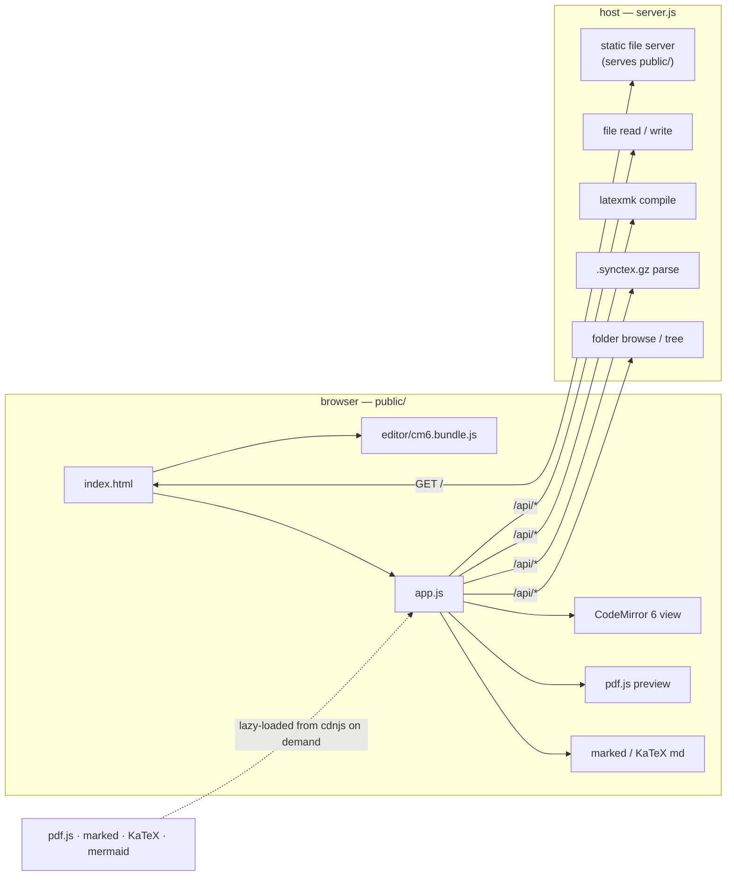

# RTL TeX Editor — architecture

Orientation for a developer or AI picking up this codebase. Pairs with
[`README.md`](README.md) (install + user guide); this file is the *how it
works*.

---

## 1. What it is

A **local, single-purpose editor** for a mixed right-to-left / left-to-right
LaTeX manuscript — e.g. a Persian document built with XeLaTeX + `xepersian`. It
is two pieces:

- **`server.js`** — a zero-dependency Node ≥ 18 host. File I/O under a chosen
  workspace root, `latexmk` builds, and SyncTeX parsing. Binds `127.0.0.1` only.
- **`public/`** — the browser front-end: a CodeMirror 6 editor, a pdf.js preview
  with two-way SyncTeX, a Markdown preview, a file tree, and a folder switcher.
  Plain ES5-ish JS, no framework, one bundled dependency (CodeMirror 6).

They talk over `/api/*` (JSON + a couple of streaming routes). There is no build
step for the app itself; the only build is the CodeMirror bundle (§8).



---

## 2. The bidi problem, and why CodeMirror 6

Every line of the manuscript mixes **RTL** Persian body text with **LTR** runs:
`\command`s, `$…$` math, `{…}` groups, `\cite{…}`, English terms, numbers. What
correct editing needs:

- **base direction per line**, chosen from content (a non-command line with
  Persian is RTL; a `\section{…}` line, a blank line, pure Latin/punctuation is
  LTR);
- **visual** caret motion — arrows / Home / End / clicks land where the glyph
  *is*, across reordered runs;
- **selection** that spans reordered runs as one contiguous highlight;
- markup (`\ { } $`) that reads **left-to-right inside** an RTL line instead of
  mirroring (`\textbf{x}` must not render as `{x}fbtxet\`, `$a^2$` not `$2^a$`).

**CodeMirror 5 could not do all of this at once.** CM5 renders a line's tokens
in *logical* order and lets the browser's Unicode Bidi Algorithm reorder them
per the CSS `direction`; separately it runs its *own* inlined copy of the bidi
algorithm purely to *predict* where to paint the caret and selection. Any CSS
that fixed the visual order of markup (`unicode-bidi: isolate` on `\command` /
`$…$` spans) desynced that prediction — the caret jumped and selection painted
nothing or garbled ranges. Three attempts, all reverted (`1c2a1f0`, `e9592e8`,
and an LTR-base experiment → `4c4542e`).

**CodeMirror 6 solves it natively:**

| need | CM6 mechanism |
|---|---|
| per-line base direction | `EditorView.perLineTextDirection.of(true)` — CM6 reads the computed `direction` of *each* rendered line and does caret/selection/motion math for that line's direction. We set `direction: rtl` per line with a `.cm-rtl-line` line decoration. |
| LTR markup inside an RTL line | a mark decoration with `bidiIsolate: Direction.LTR`, **also** exposed through the `EditorView.bidiIsolatedRanges` facet. CM6 folds the isolate into *its own* bidi pass, so visual order **and** caret/selection agree. |

`pinOrder`, `dirAwareMotion` and the ~100-line inlined `bidiOrder` from the CM5
version are **gone** — CM6 does all of it.

(Historical note: `bidi-extension.md`, now removed, was the original design
sketch for doing this as a VS Code / Monaco extension. That path was rejected —
an extension has no DOM access and cannot fix Monaco's caret — in favour of
"approach A": a webview/browser editor where the browser does bidi natively.
This project is approach A as a standalone tool rather than a VS Code webview.)

---

## 3. Repository layout

| Path | Role |
|---|---|
| `server.js` | The host. Args, routes, SyncTeX parser, `latexmk` runner, static server. |
| `public/index.html` | Shell markup. Loads `editor/cm6.bundle.js` then `app.js`. |
| `public/app.js` | The whole front-end (≈1150 lines). Sectioned by banner comments — see §6. |
| `public/styles.css` | All styling. Theme tokens on `#app[data-theme]`; `@font-face`; `.cm-*` structure + RTL rules (colours come from the bundle). |
| `public/editor/src/index.js` | **Source** of the CodeMirror 6 bundle. See §7. |
| `public/editor/cm6.bundle.js` | esbuild output (`window.RTLCM`), **committed**. Rebuild with `npm run build:editor`. |
| `package.json` | `devDependencies` (`@codemirror/*`, `esbuild`) + `build:editor` script. Runtime is still zero-dependency. |
| `rtl-tex-editor.bat` / `.sh` | Launchers (Windows / Linux-macOS). Start the server, open the browser. |
| `.gitattributes` | `*.sh` → LF, `*.bat` → CRLF; the generated bundle marked `linguist-generated`. |
| `.gitignore` | `node_modules/`, `public/vendor/`, TeX aux, OS cruft. |
| `ARCHITECTURE.md` / `README.md` | this file / install + user guide |

---

## 4. The host — `server.js`

Startup: `node server.js [--root <dir>] [--port <n>] [--engine xelatex|pdflatex|lualatex] [--lock-root]`.
Defaults: root = cwd, port = 5199, engine = xelatex. `--lock-root` hides the
in-UI folder switcher. Everything is served from and written under `ROOT`;
`safeResolve` rejects paths that escape it.

### Routes (`api()` dispatch on `pathname`)

| Method + path | Purpose | Returns |
|---|---|---|
| `GET /api/health` | probe `latexmk -v` | `{root, rootName, engine, rootFromCli, lockRoot, latexmk, synctex, version}` |
| `GET /api/tree` | recursive file tree from `ROOT` (skips `.git`, `node_modules`, …) | `{root, rootName, tree}` |
| `GET /api/browse?path` | one dir's sub-folders (+ Windows drives) for the folder picker | `{path, parent, dirs, drives, error?}` |
| `POST /api/root {path}` | switch `ROOT` at runtime (disabled by `--lock-root`) | `{root, rootName}` |
| `GET /api/file?path` | read a file (UTF-8, ≤ 5 MB) | `{path, content, mtimeMs}` |
| `PUT /api/file?path&mtime` | write; `mtime` ≠ `force` → 409 `{conflict:true, mtimeMs}` if disk is newer | `{ok, mtimeMs}` |
| `POST /api/compile {main}` | `latexmk -<engine> -synctex=1 -shell-escape -interaction=nonstopmode -halt-on-error -file-line-error`; retries once with `-g` if latexmk latched a stale failure | `{ok, code, log, pdf, durationMs}` |
| `GET /api/pdf?path` | stream a built PDF (`no-store`) | pdf bytes |
| `GET /api/synctex?main&file&line` | forward search (§9) | `{ok, page, line, h, v, W, H, D, unit, mag, xoff, yoff}` |
| `GET /api/synctex-reverse?main&page&h&v` | reverse search (§9) | `{ok, file, line}` |
| `GET /api/pdfjs-worker` | re-serves the pinned pdf.js `pdf.worker.min.js` from our origin (cdnjs blocks a cross-origin `new Worker`); fetched once, cached in memory | JS bytes |
| anything else | static from `public/` (MIME by extension; `startsWith(PUBLIC)` guard) | file bytes |

### Security posture

`latexmk -shell-escape` runs arbitrary code from the project. The server binds
`127.0.0.1` only and refuses paths outside `ROOT`. Point `--root` at a folder
you trust.

---

## 5. Client boot sequence (`app.js` → `boot()`)

1. `restoreLayout()` — reads `localStorage` (`rwe.*`, §11): theme, editor side,
   `dir` mode, sync on/off, PDF-invert mode, sidebar/pane sizes, expanded tree
   nodes.
2. Guard: `typeof RTLCM === 'undefined'` → show "editor bundle failed to load".
3. `initEditor()` — builds the CodeMirror 6 view via `RTLCM.create(...)` (§7),
   stores `ed` + `view`, wires the pane tweens and scroll-stop listeners.
4. `GET /api/health` → `latexmk` status in the toolbar; `syncCap.synctex`.
5. `loadTree()` → render the file tree, populate the **main** `.tex` dropdown
   (guesses `main.tex` / `thesis.tex`, else the first `.tex` in the tree).
6. Reopen `rwe.lastFile` if set; scan the first `references.bib` for `\cite`
   keys.

---

## 6. The front-end — `public/app.js`

One IIFE, no exports. `$` = `querySelector`. `LS` = namespaced (`rwe.`)
JSON localStorage. Section banners, in file order:

| Section | What lives there |
|---|---|
| **word lists** | `LATEX_CMDS`, `LATEX_ENVS`, `ARG_CMDS` (commands that take a first braced arg), `BIB_KEYS`, `collectMacros(text)` (parses `\newcommand` / `\DeclareMathOperator`). Handed to the bundle's completion source. |
| **editor** | `ed` / `view` globals; `{line,ch}↔offset` helpers (`offAt`, `posAt`, `setCaret`, `edScroll`, `edHeightAtLine`); `lineIsRtl(s)` = `HAS_FA_RE.test(s) && !CMD_LINE_RE.test(s)` (the single source of truth for "is this line RTL", passed into the bundle); `applyDir()` = `ed.setDir(LS.get('dir'))`; `initEditor()`; `refreshCM()` = `ed.refresh()`. |
| **file state** | `curf = {path, mtimeMs, saved}`; `isDirty()`; `api(path, opts)` fetch wrapper; `openFile(rel)` (dirty-check → GET → `ed.setDoc` → caret home → md/pdf preview switch); `saveFile(force)` (PUT, 409 → confirm → retry `force`). |
| **build** | `build()` — save if dirty → `POST /api/compile` → on success set the PDF src and `loadPdf()`; on failure open the log bar. `renderLog(text)` colourises `!`/error/warning lines. |
| **markdown preview** | The right pane is a Markdown viewer when a `.md` file is open. `ensureMdLibs()` lazy-loads marked + DOMPurify + KaTeX (+ mermaid only if a diagram is present) from cdnjs. `mdToDom(src)` pulls code + math out before `marked` parses, splices KaTeX back, tags each top-level block with `data-src-line` for scroll sync. |
| **pdf viewer** | pdf.js `PDFViewer` (not the browser plugin) so we can scroll to a point, flash a box, and read clicks for reverse SyncTeX. `ensurePdfLibs()` loads `pdf.min.js` then `pdf_viewer.min.js` (order matters — see §10). `pdfWorkerSrc()` = a same-origin blob worker that `importScripts()` the cdnjs worker, else `/api/pdfjs-worker`. `loadPdf(url)` has a `pdfSeq` re-entrancy guard and waits for the pane to have width. `onPdfClick` → `reverseSync` → `jumpToSource`. `flashLine(ln)` → `ed.flash(ln)`. PDF dark mode: `pdfInvert` ∈ `auto|on|off`, `applyPdfInvert()` toggles `.pdf-invert` (CSS `filter: invert() hue-rotate()`), `cyclePdfInvert()` on **Alt+I** or the ◐ button. |
| **view sync** | `⇅` toggle. `tw` = per-pane eased-scroll tweens (`makePaneTween`); `paneBusy(name)` distinguishes a programmatic scroll from a user one. `syncFromEditor()` → `mdSyncFromEditor` (anchored on `data-src-line`) or `pdfSyncFromEditor` (`GET /api/synctex` → `pdfGoto` + `showSynctexHighlight`). `onCaretActivity()` runs the caret-driven forward sync, guarded by `reverseJumpGuard` so a PDF-click jump doesn't bounce back. |
| **status / file tree / main file / splitters / toolbar / open folder** | small, self-describing. Tree click opens a file or toggles a dir; the ⚙ toolbar buttons cycle theme / dir / sync / editor-side; drag bars resize and call `refreshCM()`. |
| **boot** | §5. |

---

## 7. The editor bundle — `public/editor/src/index.js`

esbuild bundles this to `public/editor/cm6.bundle.js` as an **IIFE** setting
`window.RTLCM`. It imports from `@codemirror/{state,view,commands,language,
autocomplete,search,legacy-modes}` and `@lezer/highlight`.

### Exports (`window.RTLCM`)

`create(opts)` plus re-exported primitives `EditorView`, `EditorState`,
`EditorSelection`, `Direction`, `Compartment` (app.js only needs a few).

### `create(opts)` — the contract

```js
const ed = RTLCM.create({
  parent,               // DOM node to mount into (#editor)
  doc,                  // initial text
  lineIsRtl,            // (lineText:string) => boolean   -- from app.js
  words: {              // for the completion source
    LATEX_CMDS, LATEX_ENVS, ARG_CMDS,
    collectMacros,      // (docText) => string[]  macro names incl. backslash
    getBibKeys,         // () => string[]
  },
  on: {                 // callbacks fired from an updateListener / DOM scroll
    save, build,        // Mod-S / Mod-B inside the editor
    docChange,          // doc edited
    selChange,          // selection/caret moved
    scroll,             // geometry or scrollDOM scroll  (rafThrottle it)
  },
});
// returns:
ed.view                 // the raw EditorView (app.js reaches through this)
ed.setDoc(text)         // replace whole doc + reset history  (old setValue+clearHistory)
ed.setDir('auto'|'rtl'|'ltr')   // per-line plugin vs forced .force-rtl/.force-ltr wrapper class
ed.flash(lineNo)        // 1.2s line highlight for reverse-SyncTeX landings
ed.refresh()            // view.requestMeasure()  (after a resize)
```

### Extensions assembled inside `create()`

- **Language / highlight** — `StreamLanguage.define(stex)` (the CM5 `stex` mode,
  via `@codemirror/legacy-modes`) + `syntaxHighlighting(HighlightStyle.define(…))`.
  Highlight colours are `var(--accent)` / `var(--ok)` / … so a theme flip needs
  no reconfigure.
- **`rweTheme`** — one `EditorView.theme({…})`, all values CSS vars from
  `#app[data-theme]`. Covers gutters, active line, panels (search), tooltips
  (autocomplete), matching-bracket box (green — deliberately *not* accent, so it
  doesn't read as the caret), and `::selection`.
- **Selection** — the browser's **native** selection (no `drawSelection()`), so
  it paints uniformly across bidi isolates: solid `--sel-bg` box, `--sel-fg`
  glyphs, in both focus states. Native caret, tinted `--accent`.
- **Per-line RTL** (`rtlLinePlugin`, in a `Compartment`) — a `ViewPlugin` that
  adds `Decoration.line({class:'cm-rtl-line'})` to every visible line where
  `lineIsRtl(text)`. `ed.setDir('auto')` installs it; `'rtl'`/`'ltr'` swap it
  for a `.force-rtl` / `.force-ltr` class on `view.dom` (CSS forces every line).
- **Bidi isolates** (`isolatePlugin`, always on) — a `ViewPlugin` that scans
  visible RTL lines with `ISO_RE` (`\command`, `\command{…}`, `$…$`, `$$…$$`,
  bare `{…}`) and emits a mark decoration per run:
  `Decoration.mark({ class:'cm-iso cm-tex-ltr', inclusive:true, attributes:{dir:'ltr'}, bidiIsolate: Direction.LTR })`.
  Shape copied from `@codemirror/language`'s own `bidiIsolates`: `.cm-iso` gets
  `unicode-bidi: isolate` from CM's base theme; `inclusive:true` lets the caret
  / a drag reach the position at the very end of the run. Provided through
  **`EditorView.outerDecorations`** (wraps around the highlight spans) **and**
  `Prec.lowest(EditorView.bidiIsolatedRanges.of(…))` (the part that keeps
  caret + selection correct).
- **`flashField`** — a `StateField<DecorationSet>` toggled by `setFlash` /
  `dropFlash` effects; `ed.flash()` sets a `.cm-flashLine` line decoration and
  clears it after 1.2 s.
- **Completion** — `autocompletion({ override:[makeLatexSource(words)], activateOnTyping:false })`.
  `makeLatexSource` ports the old `latexHint`: `\cite{…}` → bib keys; `\begin{env`
  → `snippetCompletion("\\begin{env}\n\t${}\n\\end{env}")` (list envs prefill
  `\item ${}`); `\end{env` → plain `env}`; `\cmd` → plain label, except
  `ARG_CMDS` → `snippetCompletion("\\cmd{${}}")` and `frac` → `"\\frac{${}}{${}}"`.
  `snippetCompletion` indents template newlines to the start line's indent + one
  unit per leading `\t`, so nested `\begin` blocks line up.
- **Base** — `lineNumbers()`, `highlightActiveLine(Gutter)()`,
  `history()`, `bracketMatching()`, `closeBrackets()`, `indentUnit.of('  ')`,
  `tabSize 2`, `EditorView.lineWrapping`, `search({top:true})`.
- **Keymap** — `Prec.highest` for `Mod-s`→`on.save`, `Mod-b`→`on.build`,
  `Tab`→`indentMore` (selection) / insert two spaces (no selection),
  `Shift-Tab`→`indentLess`; then `defaultKeymap`, `historyKeymap`,
  `closeBracketsKeymap`, `completionKeymap`, `searchKeymap`.
- **Reclaimed chords** — a capture-phase `keydown` listener on `view.dom`
  intercepts `Ctrl+Shift+Digit2` while the editor has focus: it
  `preventDefault`s the browser's action (some browsers open/switch a tab on
  that chord and eat the keystroke) and inserts the character the layout
  produced (`e.key`, when it is one printable char) itself, so a Persian
  typist's Ctrl+Shift+2 still types. Extend `RECLAIM_CODES` for other slots.

---

## 8. Build & offline

- **Editor**: `npm install` (adds `@codemirror/*` + `esbuild` as
  `devDependencies`) then `npm run build:editor` →
  `esbuild public/editor/src/index.js --bundle --format=iife --global-name=RTLCM
  --outfile=public/editor/cm6.bundle.js --target=es2018 --minify` (~360 KB).
  **The bundle is committed**, so `node server.js` and the launchers run with no
  `npm install`. Editing `src/index.js` requires a rebuild; nothing else does.
- **Lazy CDN assets** (loaded by `app.js` only when needed, from cdnjs / jsDelivr):
  pdf.js `3.11.174` (pinned — last classic-UMD build), `marked` + `DOMPurify` +
  `KaTeX` + `mermaid`, and the DejaVu Sans / IRANSansWeb `@font-face` files.
  Offline you get: full editing, no PDF/Markdown preview, system-font fallback.
- No other build step. `app.js` / `styles.css` / `server.js` are shipped as-is.

---

## 9. SyncTeX

`latexmk -synctex=1` writes `<base>.synctex.gz`. The server parses it directly
(`zlib.gunzipSync` + a line scanner) — **no external `synctex` binary**.

- **Record regex** `SYNCTEX_REC` — groups: `1` type char, `2` tag (input-file
  id), `3` source line, `4` h, `5` v, `6` W, `7` H, `8` D. All positions in
  **scaled points** (sp); `1 pt = 65536 sp`.
- **Forward** (`/api/synctex`, `synctexForward`): resolve the requested file to
  its tag, scan records for that tag, pick the one nearest the requested line
  (prefer a record *at or after* the line, prefer one with a box). Return its
  page + geometry + the file's `unit`/`mag`/`xoff`/`yoff` header fields.
  `app.js` converts to PDF points:
  `xPt = (h*unit + xoff) / 65536 * mag/1000`, likewise `v`, then flips `v`
  against the page height for pdf.js's top-left origin, calls
  `pdfViewer.scrollPageIntoView` and paints a fading `.synctex-hl` box.
- **Reverse** (`/api/synctex-reverse`, `synctexReverse`): given page + click
  (h, v in sp), scan **leaf** records on that page (skip the `(` / `[`
  enclosing boxes — the master file's page vbox spans the whole page and would
  swallow every click), pick nearest by |Δv| then |Δh|, smaller box wins. Return
  `{file, line}`. `app.js` opens that file (multi-file `\include` aware) and
  flashes the line.

---

## 10. Known limits & gotchas

- **pdf.js load order** — `pdf_viewer.min.js` grabs `globalThis.pdfjsLib`
  eagerly, so `pdf.min.js` must finish loading first (`loadAssets` is
  sequential, `script.async = false`).
- **pdf.js `annotationEditorMode: -1`** is required, or `PDFViewer` builds an
  `AnnotationEditorUIManager` with a null `altTextManager` whose `destroy()`
  throws on teardown.
- **Isolate regex is not recursive** — `\section{\textbf{x}}` isolates
  `\section` and `\textbf{x}` separately, not the outer braces. Fine for the
  common cases (`\ref{fig:x}`, `$x^2$`, `\textbf{…}`).
- **No multi-cursor visuals** — native selection shows only the primary range
  (single-caret editing is the design).
- **Selected glyphs are `--sel-fg`** via native `::selection`; there is no
  per-selection syntax recolour.
- **Headless Chrome** is broken in some environments here — verify editor
  behaviour in a real browser.
- **`url.parse`** in `server.js` triggers a Node deprecation warning; harmless,
  left for zero-dependency simplicity.

---

## 11. Persistence (`localStorage`, `rwe.` prefix)

`theme` · `side` (editor left/right) · `dir` (`auto`/`rtl`/`ltr`) · `sync`
(bool) · `pdfInvert` (`auto`/`on`/`off`) · `showAux` (bool) · `sidebarW` ·
`edFlex` (editor/PDF split ratio) · `expanded` (tree node paths) · `lastFile` ·
`main` (main `.tex`) · `recentRoots` · `dirReset2` (one-time migration flag).

---

## 12. Fonts

`styles.css` defines `--ui-font` (DejaVu Sans → system sans) and `--mono-font`
(IRANSansWeb → system mono) with **IRANSansWeb first in every stack but confined
by `unicode-range` to Persian/Arabic codepoints** — so Persian glyphs use
IRANSansWeb everywhere (UI *and* the monospace editor), Latin falls through to
DejaVu / the mono stack. `@font-face` pulls the woff2 files from jsDelivr with
`font-display: swap`.

---

## 13. Dev workflow

| You changed… | Then… |
|---|---|
| `server.js` | restart the server |
| `public/app.js`, `styles.css`, `index.html` | reload the browser (server serves them live, `no-store`) |
| `public/editor/src/index.js` | `npm run build:editor`, then reload; commit `cm6.bundle.js` alongside the source |
| a `@codemirror/*` version | `npm install`, `npm run build:editor`, sanity-check, commit `package.json` + `package-lock.json` + the bundle |

Quick bundle sanity check without a browser:

```sh
node -e 'global.window=global;global.self=global;global.navigator={userAgent:"node"};
global.document={documentElement:{style:{}},createElement:()=>({style:{},setAttribute(){},appendChild(){},classList:{add(){},remove(){},toggle(){}},remove(){}}),addEventListener(){},head:{appendChild(){}},body:{}};
global.requestAnimationFrame=()=>0;
(0,eval)(require("fs").readFileSync("public/editor/cm6.bundle.js","utf8"));
console.log(Object.keys(RTLCM));'
```
